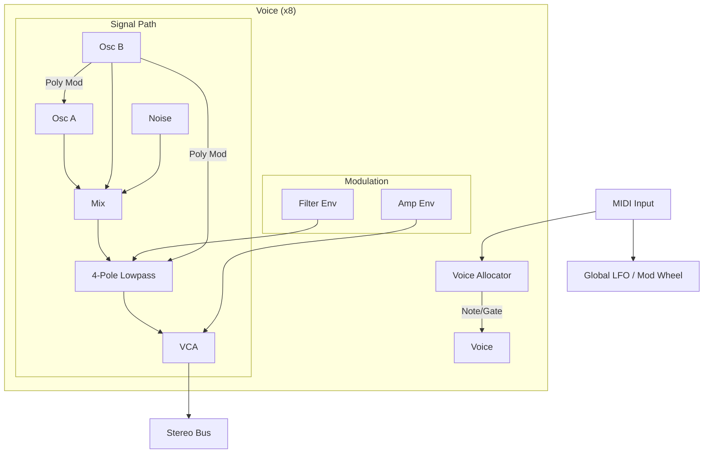

# 02. Architecture: "The Hub & Spokes"

## 1. Core Principles
To satisfy our requirement for both Desktop Plugins (AU/VST3/CLAP) and Embedded Hardware (Daisy, Elk), we use a strict "Hub & Spoke" architecture.

### 1.1 The Hub (Platform Agnostic DSP)
Located in `src/core`. This is pure C++17.
*   **Dependencies**: NONE (Standard Library only, strictly limited).
*   **Forbidden**: `malloc`, `new`, `printf`, `std::cout`, File I/O.
*   **Interface**: A C-style ABI friendly `Engine` class.
*   **Precision**: Configurable via `sample_t` (`double` or `float`).

### 1.2 The Spokes (Platform Adapters)
Located in `src/platform`.
*   **Desktop (iPlug2)**: Wraps `src/core/Engine`. Handles UI, Presets, DAW I/O.
*   **Embedded (Daisy)**: Wraps `src/core/Engine`. Handles GPIO, ADC/DAC callbacks.

## 2. Directory Structure

```
/polysynth
├── plans/                  # This documentation
├── src/
│   ├── core/               # THE HUB
│   │   ├── Engine.h        # Main API
│   │   ├── VoiceManager.h  # Polyphony Logic
│   │   ├── oscillator/     # PolyBLEP / Wavetable
│   │   ├── filter/         # ZDF Filter
│   │   ├── modulation/     # Envelopes / LFOs
│   │   └── utils/          # Math, RingBuffers
│   └── platform/           # THE SPOKES
│       ├── desktop/        # iPlug2 Project
│       │   ├── config.h
│       │   └── PolySynth.cpp
│       ├── daisy/          # (Future) DaisySeed Project
│       └── tst/            # "Headless" Test Runner
├── tests/                  # Catch2 Unit Tests
│   └── main_test.cpp
└── external/               # Submodules (iPlug2, Catch2)
```

## 3. DSP Topology (Voice Architecture)
Inspired by the Prophet-5 rev 3.



## 4. Key Classes
*   **`Engine`**: The facade. Receives `process(inputs, outputs, frames)` calls and MIDI events.
*   **`VoiceManager`**: Owns `std::array<Voice, 8>`. Handles stealing (oldest/quietest).
*   **`ModMatrix`**: Fixed-size matrix connecting Sources (LFOs, Envelopes) to Destinations (Pitch, Cutoff).
*   **`FastMath`**: Wrapper for `std::sin`, `std::exp` that can map to hardware implementations or approximations.

## 5. Threading Model
*   **Audio Thread**: High priority. Locks are FORBIDDEN. Allocations are FORBIDDEN.
*   **Control/UI Thread**: Lower priority. 
*   **Communication**: 
    *   **UI -> Audio**: `std::atomic` for parameters. Lock-free FIFO for events (e.g., loading a preset).
    *   **Audio -> UI**: Lock-free FIFO for visualizations (e.g., scope, meters).
